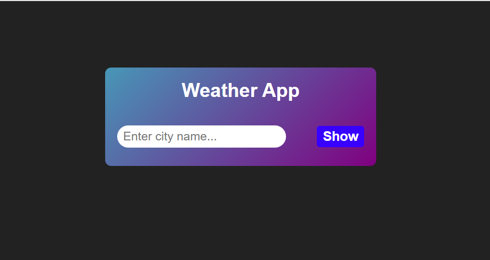
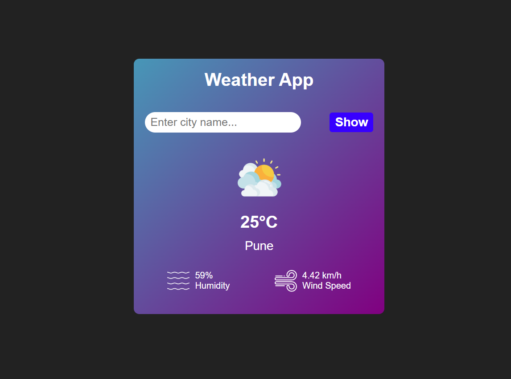
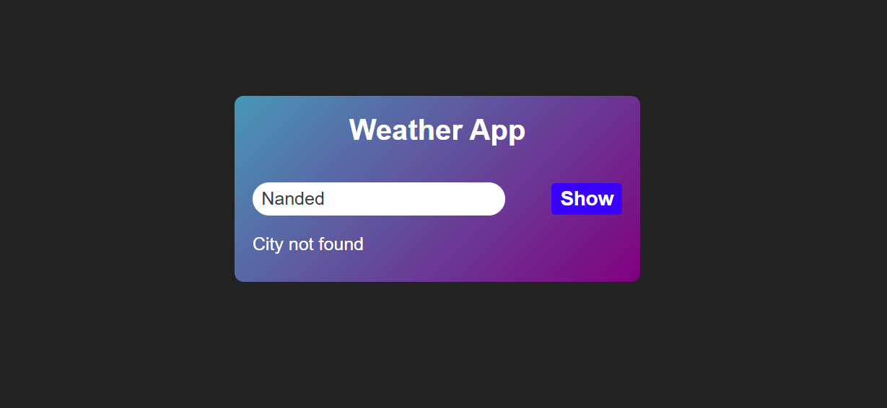

# 🌤 Weather App

## 📌 About  
The **Weather App** is a simple web application that allows users to check the weather of any city by entering its name. It fetches real-time weather details using an API and displays them in a user-friendly interface.

## 🚀 Features  
✔️ Enter a city name to get real-time weather details  
✔️ Fetches weather data using an API  
✔️ Displays an error message if the city is not found in the API  
✔️ Shows an alert if the search is submitted without entering a city name  

## 🛠 Technologies Used  
- **HTML** – Structure of the application  
- **CSS** – Styling and layout  
- **JavaScript** – Logic and API handling  

## 🔗 API Used  
This app uses [Weather API](https://api.openweathermap.org/data/2.5/weather?units=metric&q={cityName}&appid=${apiKey}) to fetch weather data.  

## 📸 Screenshots  
### 🌟 Home Page
  

### 🌟 Weather Details
  

### 🌟 Error Message (City Not Found)
  

### 🌟 Alert Message (Enter city name)

 

## 🚀 How to Run the Project  
1. Clone the repository:  
   ```bash
   git clone https://github.com/your-username/Weather-App.git
   ```
2. Open `index.html` in your browser  
